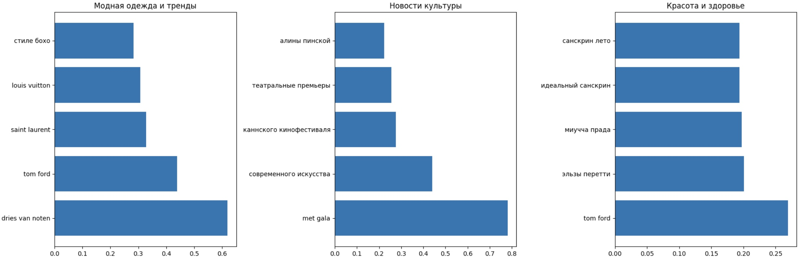

# the-blueprint-nlp

[](https://colab.research.google.com/github/ghostfr1end/the-blueprint-nlp/blob/main/notebooks/TheBlueprint_project_clean_1.ipynb)

NLP-анализ Telegram-канала **The Blueprint** за март–май 2025: эмбеддинги + векторный поиск (FAISS), n-граммы, таймлайны событий/трендов.

## Быстро посмотреть
- 📓 Основной ноутбук: `notebooks/TheBlueprint_project_clean.ipynb` (кнопка Colab выше).
- 🖼 Превью результатов:
  - Таймлайн упоминаний (ивенты/бренды/микротренды):  
    
  - Топ биграмм по рубрикам (бар-чарты):  
    

## Стек
`sentence-transformers (paraphrase-multilingual-mpnet-base-v2)`, `FAISS`, `pandas`, `numpy`, `scikit-learn (TfidfVectorizer)`, `matplotlib`.

## Как запустить
**В Colab:** нажмите на бейдж выше и следуйте ячейкам (загрузите `data/result.json` при запросе).  
**Локально:**
```bash
git clone https://github.com/ghostfr1end/the-blueprint-nlp.git
cd the-blueprint-nlp
python -m venv .venv && source .venv/bin/activate   # Windows: .venv\Scripts\activate
pip install -r requirements.txt
jupyter notebook notebooks/TheBlueprint_project_clean.ipynb
